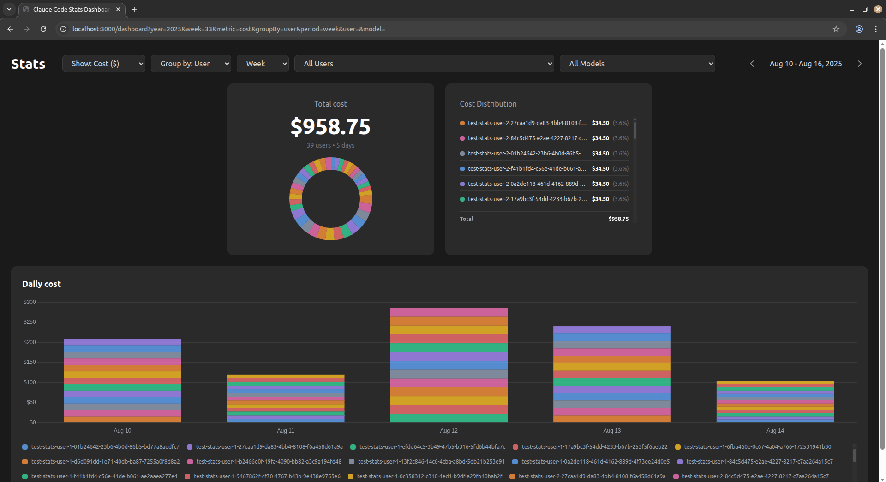

# Claude Code Stats Server

> 📊 **Track, visualize, and optimize your Claude Code AI assistant usage with powerful analytics**

Transform your Claude Code usage data into actionable insights.
Monitor costs, track token consumption, and identify usage patterns across your team with beautiful,
interactive dashboards.

## 🎯 Why Claude Code Stats Server?

[Claude Code](https://www.anthropic.com/claude-code) is Anthropic's command-line AI coding assistant that embeds
Claude Code directly into your terminal. While it turns hours-long workflows into single commands,
understanding your usage patterns and costs can be challenging. This server solves that by:

- **📈 Real-time Cost Tracking** - Know exactly how much you're spending daily, weekly, and monthly
- **👥 Multi-user Support** - Track usage across your entire development team
- **🎨 Beautiful Dashboards** - Interactive charts that make data analysis effortless
- **🔄 Automated Collection** - Set up once, track forever with our upload script
- **🐳 Docker Ready** - Deploy in minutes with our pre-built Docker image

## 📸 Dashboard Preview



The dashboard provides comprehensive insights into your Claude Code usage:

### Main Dashboard Features:
- **📊 Daily Usage Chart** - Stacked bar chart showing token costs per user over time
- **🍩 Cost Distribution** - Donut charts breaking down total, input, and output token costs
- **👤 User Breakdown** - Individual user contributions to total costs
- **📅 Time Period Filters** - View last week, current month, or all-time data
- **🔍 Advanced Filtering** - Focus on specific users or models

### Dashboard URL
The root URL (`http://your-server:3000/`) automatically redirects to the dashboard.
Direct access: `http://your-server:3000/dashboard`

API documentation (Swagger UI): `http://your-server:3000/swagger`

Query parameters:
- `?period=week` (default) - Show last 7 days
- `?period=month` - Show current month
- `?period=all` - Show all data
- `?user=username` - Filter by specific user

## 🚀 Quick Start

### Using Docker (Recommended)

Pull and run the official Docker image:

```bash
docker run -d \
  --name claude-stats \
  -p 3000:3000 \
  -e DB_HOST="your-postgres-host" \
  -e DB_PORT="5432" \
  -e DB_NAME="claude_code_stats" \
  -e DB_USER="postgres" \
  -e DB_PASSWORD="your-password" \
  -e ADMIN_API_KEY="your-secret-admin-key" \
  idachev/claude-code-stats-server:latest
```

See [Docker Image Documentation](docs/docker-image.md) for detailed setup instructions.

Docker Hub: [idachev/claude-code-stats-server](https://hub.docker.com/r/idachev/claude-code-stats-server/tags)

### Manual Installation

1. Clone the repository
2. Copy `.env.template` to `.env` and configure
3. Install dependencies: `pnpm install`
4. Setup PostgreSQL database
5. Run migrations: `pnpm db:migrate`
6. Start server: `pnpm start`

## 📤 Uploading Your Stats

The stats server ingests data from [ccusage](https://github.com/ryoppippi/ccusage), a Claude Code usage tracking CLI tool
that provides detailed JSON output of your token consumption and costs.

### Automatic Upload Script

Use our convenient upload script to send your Claude Code usage data to the server:

```bash
# Set environment variables
export CLAUDE_CODE_STATS_SERVER_URL="http://your-server:3000"
export CLAUDE_CODE_STATS_SERVER_USERNAME="your-username"
export CLAUDE_CODE_STATS_SERVER_API_KEY="your-api-key"

# Run the upload script
./utils/upload-stats/upload-stats.sh
```

The script will:
1. Collect usage data using `ccusage --json`
2. Securely upload to your stats server
3. Confirm successful upload

See [Upload Script Documentation](utils/upload-stats/README.md) for automation with cron and detailed configuration.

### Manual Upload

You can also upload stats manually using the API:

```bash
npx ccusage --json > stats.json
curl -X POST \
  -H "Content-Type: application/json" \
  -H "X-API-KEY: your-api-key" \
  --data-binary @stats.json \
  "http://your-server:3000/claude-code-stats?username=your-username"
```

## 🔑 User Management

### Admin Dashboard
Access the powerful web-based admin dashboard for comprehensive user management:
- **URL**: `http://your-server:3000/dashboard/admin`
- **Authentication**: Session-based with CSRF protection (login with admin API key)

#### Key Features:
- **👤 User Management**: Create users, regenerate API keys, deactivate accounts
- **🏷️ Tag System**: Organize users with tags for better categorization
- **🔍 Advanced Search**: Real-time search by username with debouncing
- **🎯 Smart Filtering**: Filter by single or multiple tags (AND logic)
- **📊 Pagination**: Customizable page sizes (10, 20, 50, 100 items)
- **🔄 Sorting**: Sort by username, creation date, or last update
- **💾 Loading States**: Skeleton loaders and progress indicators
- **🔔 Toast Notifications**: Non-intrusive feedback for all actions
- **🔐 Security**: CSRF protection on all state-changing operations
- **📱 Responsive**: Full-width layout optimized for desktop use

### CLI Scripts
Use our helper scripts for programmatic user and API key management:

```bash
# Set admin credentials
export CLAUDE_CODE_STATS_SERVER_URL="http://your-server:3000"
export CLAUDE_CODE_STATS_SERVER_ADMIN_API_KEY="your-admin-key"

# Create a new user with tags
./utils/helpers/create-user.sh developer1 --tags "team-alpha,backend"

# Regenerate API key for existing user
./utils/helpers/regenerate-user.sh developer1
```

See [User Management Scripts](utils/helpers/README.md) for detailed documentation and troubleshooting.

## 🛠️ Development

For development setup, API documentation, and contribution guidelines, see:
- [Development Guide](docs/dev.md) - Setup, commands, and project structure
- [CLAUDE.md](CLAUDE.md) - Important development guidelines

## 🐳 Docker & Deployment

- [Docker Image Documentation](docs/docker-image.md) - Complete Docker deployment guide
- [GitHub Secrets](docs/github-secrets.md) - Setting up automated Docker builds

## 📝 License

MIT

---

Built with ❤️ to help teams optimize their AI-assisted development workflows
